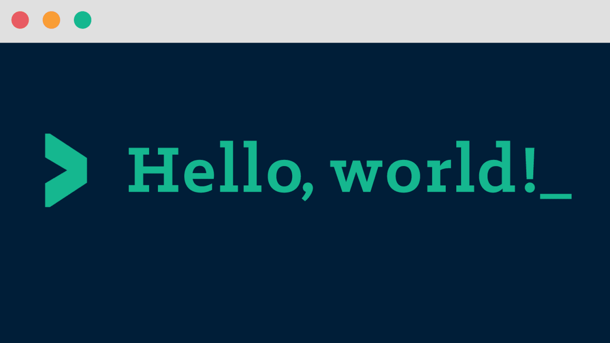

# Hello-World 🌫️ 
<div align="center">
  
  <br> <br>
  
  
  
  <br>
  <strong>I am aiming to make this in 50 languages 💖<strong>
</div>

## contributing 📝

### Step 1: Clone The Repo 💡

Fork the repository and then clone it locally by doing -

```bash
git clone https://github.com/gamingboots/Hello-World.git
```

### Step 2: Build Your Code 🔨

Start your magic by modifying the code and making changes of your own. Then push the commit using -

```bash
git add .
git commit -m "<your commit message here>"
git push YOUR_REPO_URL develop
```

### Step 3: Create a new pull request 🔃

After cloning & setting up the local project you can push the changes to your github fork and make a pull request.
## ✨ Contributors

Contributions are always welcomed :D
    
<a href="https://github.com/gamingboots/Hello-World/graphs/contributors">
  
</a>


------
